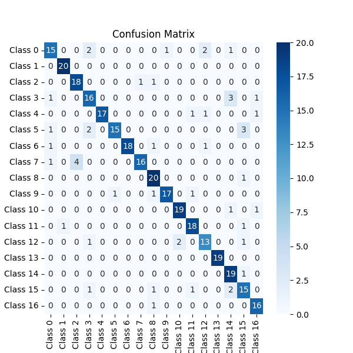

## Flower Classification

- classification 17 Flower with Pytorch.

### Project Features:

- Use Transfer Learning with densenet.
- Use Data Augmentation.

### Results:

| Data       | Loss   | Accuracy |
|------------|--------|----------|
| Train      | 1.6652 | 0.8293   |
| Validation | 1.6595 | 0.8177   |
| Test       | 1.5869 | 0.85     |

### Dataset:

- [Kaggle](https://www.kaggle.com/datasets/saidakbarp/17-category-flowers)